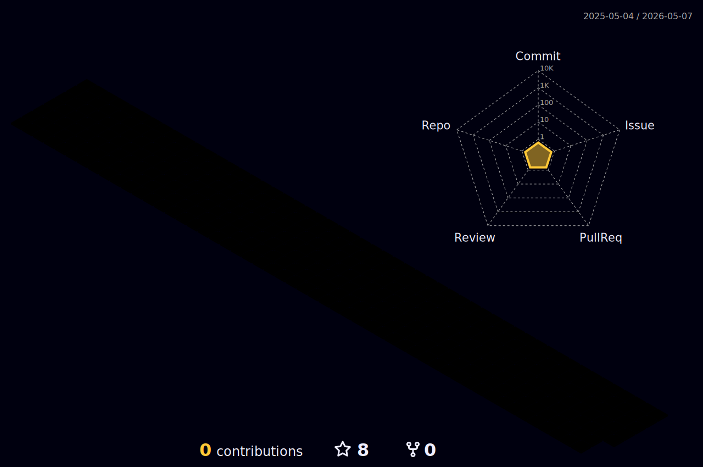

 

Hey 🖐️ friends. Thanks for stopping by! I'm very passionate about learning and building things I want, and hope to share my passion and knowledge to the community who's given me so much🤗 Let's do this! ༼ง’̀-‘́༽ง 🚀    
   
Besides programming, I enjoy playing badminton🏸, making Youtube videos🎉, reading philosophy📗, and watching anime🌸  

<strong>Programming languages I use</strong>:
 

<strong>Frameworks/Libraries I use</strong>: 

